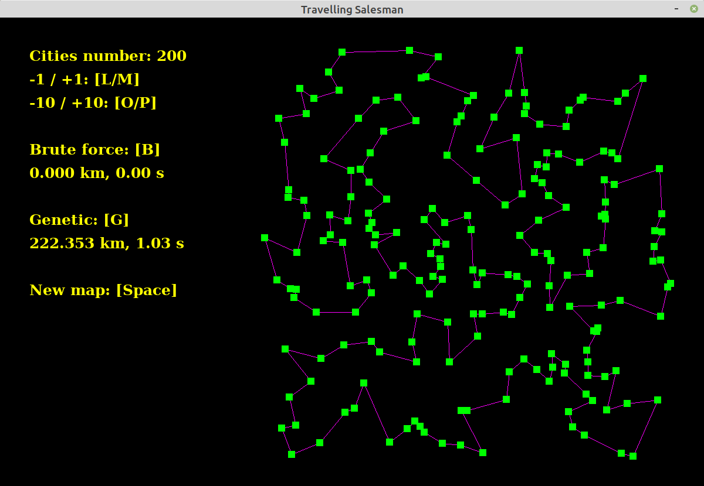

# Salesman

*Genetic (like) approach to the Travelling Salesman Problem*




## Installation

Only Linux (Ubuntu) is supported at this time.

* Installing the graphical library SDL2, and some FreeType fonts:

```
sudo apt install libsdl2-dev libsdl2-image-dev libsdl2-ttf-dev libfreetype6-dev
```


## Compilation

Compiling is done by running ``` make ```.


## Runtime

```
./salesman.exe
```


## Known issues

SDL2 v2.0.10 causes a drawing bug: rendering something changes the color of a specific pixel of the last drawn object. This bug however is not present in versions 2.0.8 and 2.0.14. Should it arise, uninstall the libsdl2-dev package, then install [this one](https://packages.debian.org/sid/libsdl2-2.0-0) and [this one.](https://packages.debian.org/source/sid/libsdl2) Finally, libsdl2-image-dev and libsdl2-ttf-dev may need to be updated after that.


## Components description

- ``` animation.c ``` Graphical interface framework.

- ``` benchmarks.c ``` Framework for benchmarking the genetic parameters.

- ``` brute_force.c ``` Brute force methods (two of them) for comparing the results with the genetic search.
	Does not support more than 13 cities in a reasonable time.

- ``` drawing.c ``` Drawing part of the graphical interface.

- ``` genetic.c ``` Genetic search framework. Many parameters of the search are tunable. Should (hopefully) produce
	decent enough solutions up to 200 cities.

- ``` matrix.c ``` Basic funtions on 2D-matrices.

- ``` pcgrand32.c ``` PCG random number generator. Has great statistical properties and is faster than UNIX rand().

- ``` permutations.c ``` Basic operations on paths.

- ``` salesman.c ``` Structure and basic functions of maps of cities.

- ``` SDLA.c ``` Small library whose purpose is to make SDL2 easier to use.

- ``` settings.h ``` Global settings.

- ``` user_inputs.c ``` Handling user inputs for the graphical interface.

- ``` utilities.c ``` General purpose functions, like time measurement.
